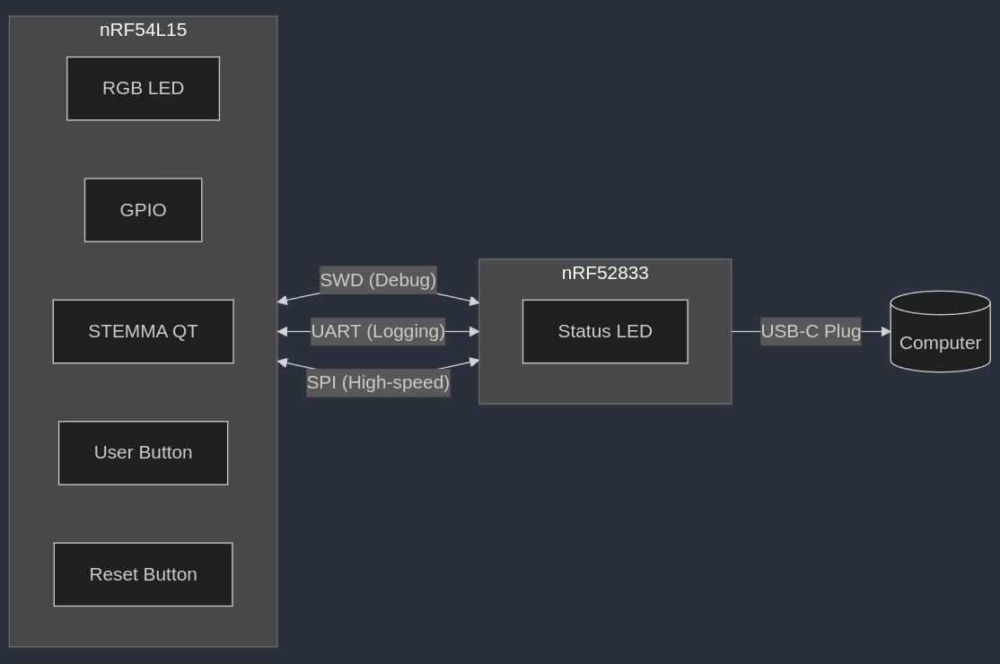
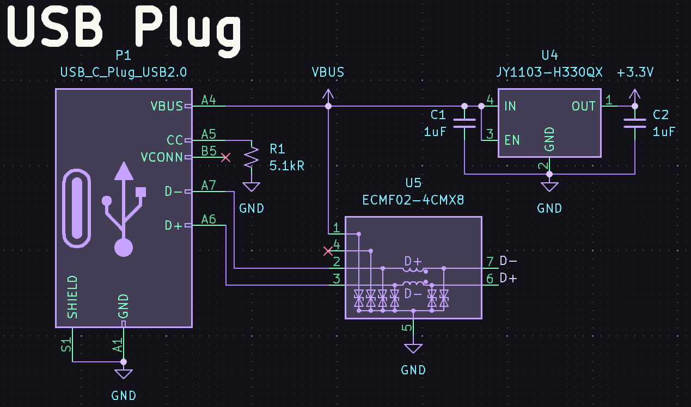
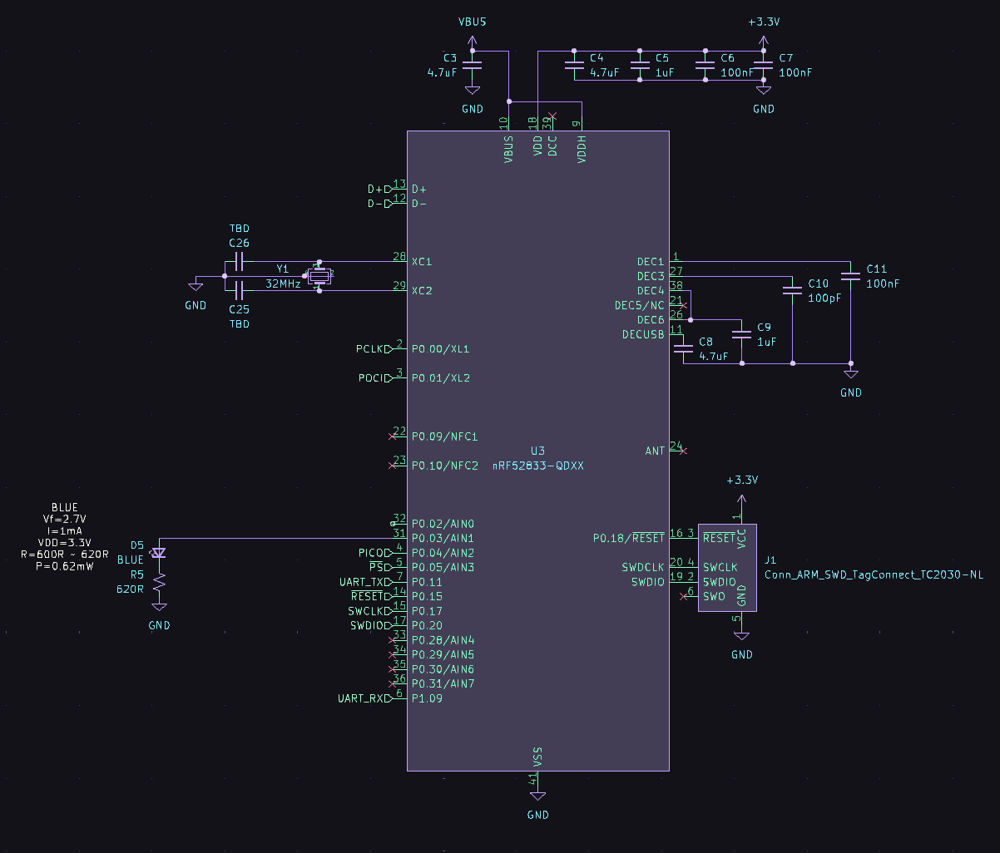
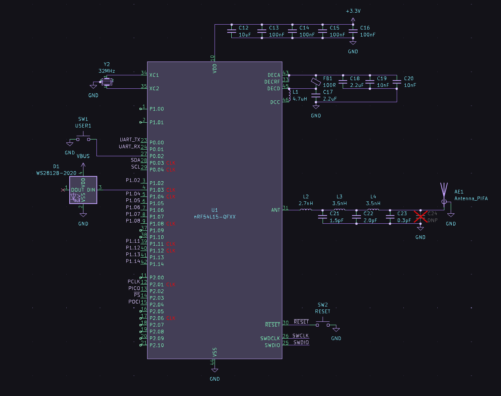
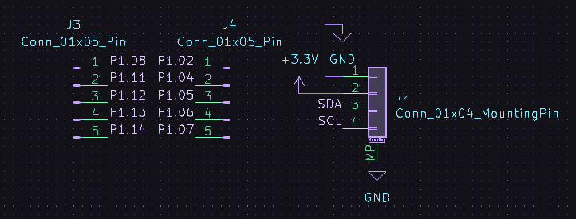

Everyone knows the nRF52840 dongle! It's an excellent way to prototype with BLE, USB or Nordic's proprietary protocols ("Enhanced ShockBurst", "Gazelle"). As solid as the dongle is, it's time (with the new nRF54L15) to add new features and creature comforts to the foundation it gave us. 

How do you perfect perfection? What does an nRF54L15 dongle look like? Here are some things to consider:
- The nRF54L15 does not have USB. We need some sort of interface chip between the L15 and the computer. I propose that we use an nRF52833 to act as a UART bridge and add some extra functionality...
- The nRF54L15 has a 4mpbs PHY! Assuming we get throughput around 2.5-3.5mbps, we've already saturated the maximum data rate of the nRF52833's UART. Let's try using SPI between the two chips.
- As with the Thingy91 X, it is possible to create a CMSIS-DAP debugger with the nRF52833. I'll connect the SWDCLK/SWDIO/RESET from the nRF54L15 to the nRF52833.
- Let's add some quality of life items: a STEMMA-QT/Qwiic connector and through holes with castellations.

So we've defined our system. Let's make a diagram:

  

I personally use KiCAD for all hardware design I do. It's quite close to being an outright Altium replacement and the price (free) is hard to pass up. Check out my KiCAD library for Nordic parts https://github.com/hlord2000/nordic-lib-kicad if you are also interested!

The nRF52833 can be powered directly from USB, but the nRF54L15 will need a 5V->3.3V regulator. Let's combine this with the USB-C plug and protection IC. 

  

Note the use of a 5.1k pull down resistor on the CC pin of the plug. This tells the upstream device, typically a computer, that this is a downstream device that can sink up to 500mA. If you were to need more power, consider using a dedicated USB power delivery (PD) PHY.

Let's move on to the nRF52833 debugger.

  

There is no need for an external 32.768KHz crystal oscillator since this design is not power constrained, so we'll use the internal RC oscillator. Any pins can be used for the peripherals on the nRF52833 and the SWD pins are bit-banged anyway, so I have connected them to the most convenient pins for routing to the nRF54L15. One small exception is the pins required to use the 32MHz high-speed SPI interface on the nRF52833 (which requires specific pins for full speed operation).

The nRF52833 debugger can itself be programmed through a Tag Connect TC2030 footprint. This saves a line on the BOM and seems to be quite common in industry. Tag Connect sells a cable that can connect to the debug out port on any Nordic devkit. The onboard debugger will also feature MCUBoot USB DFU if it becomes necessary to update firmware.

Now for the star of the show! I have added the nRF54L15 in QFN package, following the reference design available here (## INCLUDE LINK ##) to ensure correct passive component values. 

  

Some notes on the nRF54L15:

- Only GPIO ports 0 and 1 support GPIO interrupts! GPIO port #2 is intended for higher power/faster peripherals and does not have an associated GPIOTE peripheral. Please refer to the product specification for more info on peripheral power domains. Suffice it to say: port 0 is the lowest power port, port 1 is in between, and port 2 uses the most power. Use this when planning what peripheral instances or pins you plan to use.
- With the nRF54L15, certain peripherals require the use of "clock pins." My schematic symbol labels which are clock pins. Refer to the product spec for a complete list of what peripherals require clock pins (SPI SCK requires one among others).
- Some peripherals on GPIO port 2 have assigned pins. (I'm a broken record: refer to the product spec :D)
- The nRF54L15 has internal load capacitors for the high frequency (32MHz) and low frequency (32.768KHz) crystals. Nice to have! This reduces board area and BOM.

For IO, the nRF54L15 has a user button, reset button, addressable LED/NeoPixel, a STEMMA-QT port, and 2.54mm pin header holes with castellated edges.

  

